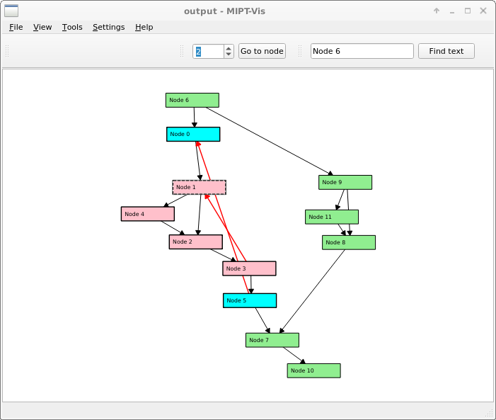

# mipt-vis-recompiled

This are updated sources to compile GNU GPL Free mipt-vis with qt5 on Linux

to generate the makefiles from the mipt-vis.pro file

qmake

Then

make

This only print what make wants to compile: make -n

This needs libxml2 assuming the include files are in /usr/include/libxml2

This setting can be changed in mipt-vis.pro file then run qmake again

Todo: more updates on the source are needed

Also see the mipt-vis original source for the unittest and sample data

Also see the showgraph tool using the GNU GPL Free graph routines from mipt-vis

🇳🇱
