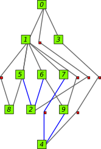
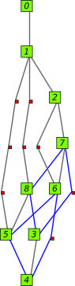
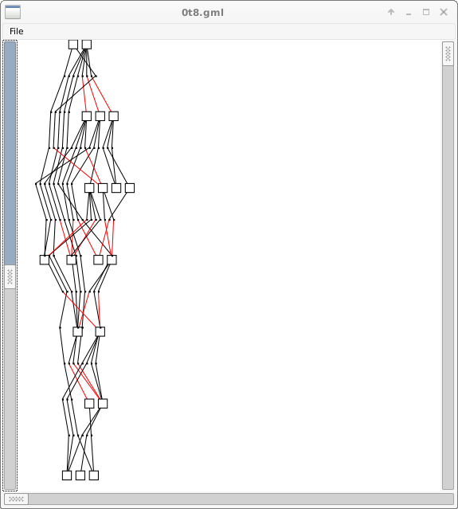

# miptgraph

GNU GPL Free C++ directed graph layout library

This is a GNU GPL Free stand-alone C++ Graph Layout Library based on GNU GPL Version 3 Free Mipt-Vis tool from Moscow Institute of Physics and Technology( MIPT)  
This project is another reincarnation of the Mipt-Vis project.  

To compile:  
./autogen.sh  
./configure  
make  

To clean: make clean  
make distclean  
make cleaner  

To indent sources: make indent  

Version 1: initial with minimal InitCoordinates() routine to be improved  
Version 2: in development

The directory src/test2 has the gtk+ gui program miptgml for use with gml graph data  
The directory src/test1 and test2 has example programs how to use this graph layout library.  
The source is documented for use with the doxygen program generating html documentation.  
The dmake script can be usd to get a log file of the make process  
This library has own routines for hierarchial graph layout and does not depend on graphviz or other libs  
This library has a c interface to use it with normal c source code  
The Graph and Layout directory does not depend on qt5 library or other libraries  
To compile this C++ with emscripten or otherwise to wasm webassembly should be possible to run it in the browser  
The user interface program must copy some graph data to/from this library to make sure it does not depend on qt5  
Because multiple graphs can be layouted independent at once it can be used to layout bigger graph with subgraphs  
There are almost no C++ libraries for graph layout with sugiyama algorithm but other GPL Free ones are ogdf, graphlhet and igraph  

Most so called graph layout programs are only spring embedder layout or drawing programs.  

Other software implementing sugiyama barycenter graph algorithm are  
C, GPL, gml4gtk graph viewer with GTK+ gui   
C, GPL, single c file directed graph layout   
C, GPL, minimize crossings with science papers   
C, GPL, unmaintined graphed editor   
C, GPL, ginger graph editor with matrix barycenter, offline  
C, GPL, rdis for Linux GTK+ gui   
C, GPL, GTK+ graph viewer with folding   
C, GPL, xsurgeon or surgeonsrc toolkit   
C++, gpl, graphlet graph viewer   
C++, GPL, big graph library   
C++, GPL, graph lib with python, R interface   
C++, MIT, bgl graph library using boost   
C++, GPL, mipt graph visualizer   
C++, GPL, mipt graph library   
javascript, MIT, dagre lib   
javascript, sugiyama drawing   
javascript, some theory info and javascript   
javascript, sugiyama drawing lib   
javascript, GPL, sugiyama in web browser   
javascript, sugiyama javascript   
javascript, blog   
javascript, MIT, mxgraph javascript   
java, sugiyama in java   
java, sugiyama,   
java, graph framework   
Python, minimize edge crossings   
Python, GPL, python drawing   
Python, GPL, python graph   
Python, BSD, maybe grakel   
Python, reduce edge crossings   
Python, mipt graph layout course   
elm, sugiyama drawing   
typescript, sugiyama drawing   
typescript, sugiyama,   
typescript, MIT, d3 dag   

SPDX-License-Identifier: GPL-3.0+  
License-Filename: LICENSE  

🇳🇱

