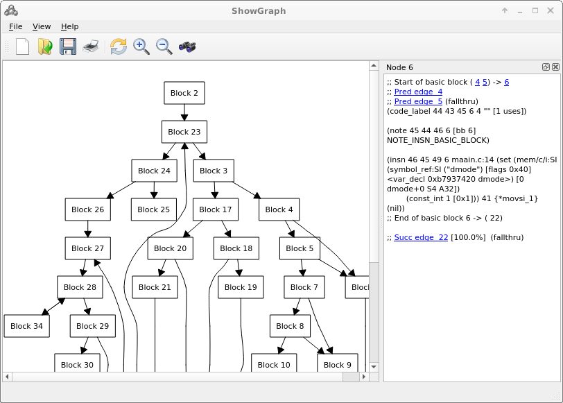

# showgraph

This is a recompilation of showgraph program for qt5 on Linux

The showgraph program has the GNU GPL Free graph layout routines from mipt-vis

The showgraph program has improved gui and parsercode

The showgrph.pro has the settings to compile with qt5

To compile:

qmake

make

In the data directory are sample compiler data and xml data

The parser code needed to update is in directory src/Frontend and/or a gml graph parser can be added

Todo: fix the source code issues, update parsers, document the layout lib and study it

See also the original showgraph which is compiled using qt4

There is also a console version of this program

The stand-alone graph layout library is in src/Core

See also the mipt-vis sourcecode which has more example source

